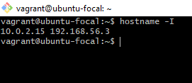
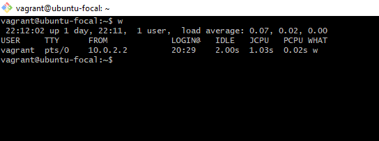
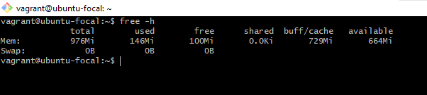
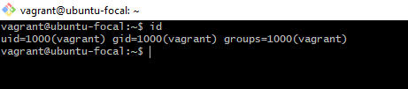
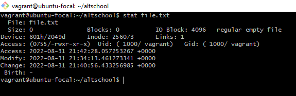
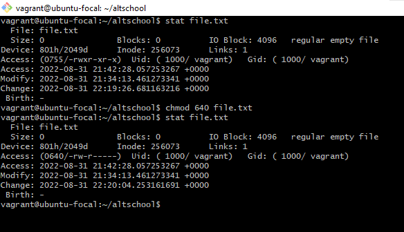
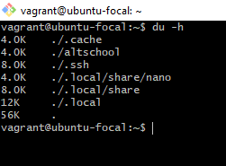
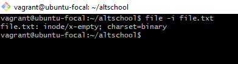
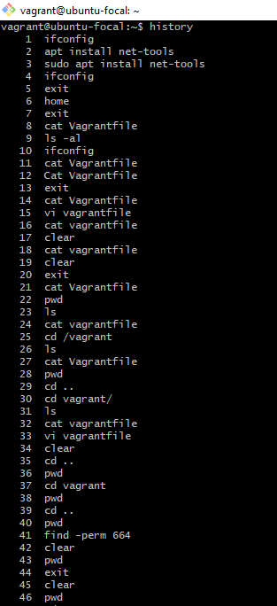
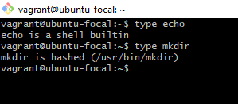

# Task:
Research online for 10 more linux commands aside the ones already mentioned in this module. Submit using your altschool-cloud-exercises project, explaining what each command is used for with examples of how to use each and example screenshots of using each of them.

## Instruction:
Submit your work in a folder for this exercise in your altschool-cloud-exercises project. You will need to learn how to embed images in markdown files.

## Solution:
<ol>
   <li><b>hostname -I</b>
   
   This command displays all local IP addresses of the host.
   
   </li>

   <li><b>w</b>
   
   This command displays who is online.
   
   </li>

   <li><b>free -h</b>
   
   This command displays free and used memory(-h for human readable, -m for MB, -g for GB).
   
   </li>

   <li><b>id</b>
   
   This command displays the user and group ids of your current user.
   
   </li>

   <li><b>stat</b>
   
   This command displays detailed info about the file such as permissions, size, mtime, ctime, atime. It shows the octal permissions. The output below has an octal value of 755, the last 0 is for special permissions such as suid, sgid and stickybit.
   664 means the users permissions are 7, group permissions are 5 and others are 5.
   
   </li>

   <li><b>chmod</b>
   
   This command stands for "change mode" which is used to change permissions of files.
   
   </li>

   <li><b>du -h file</b>
   
   This command is used for checking the size of directories.
   
   </li>

   <li><b>file -i file</b>
   
   This command is used to display the MIME (indicates the nature and format of the document or file) type of the file.
   
   </li>

   <li><b>history</b>
   
   This command shows everything typed in the terminal.
   
   </li>

   <li><b>type</b>
   
   This command tells you whether a linux command is built-in shell command, where is it's executables located and whether it is aliased to some other command.
   
   </li>
</ol>

