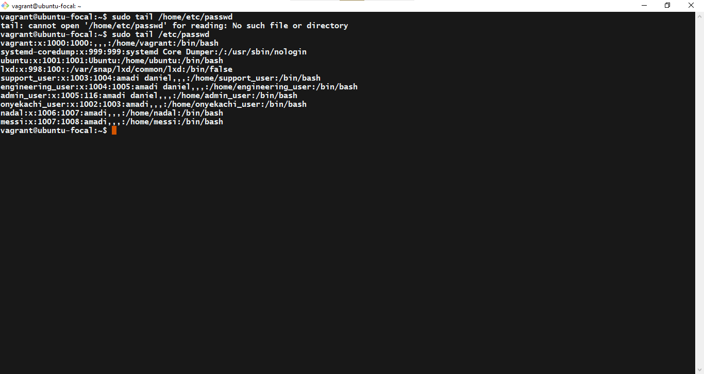
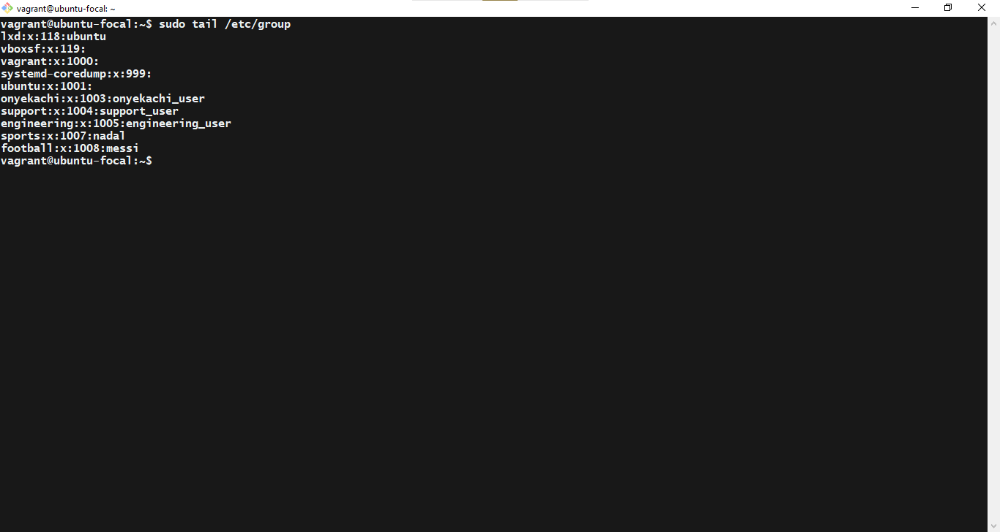
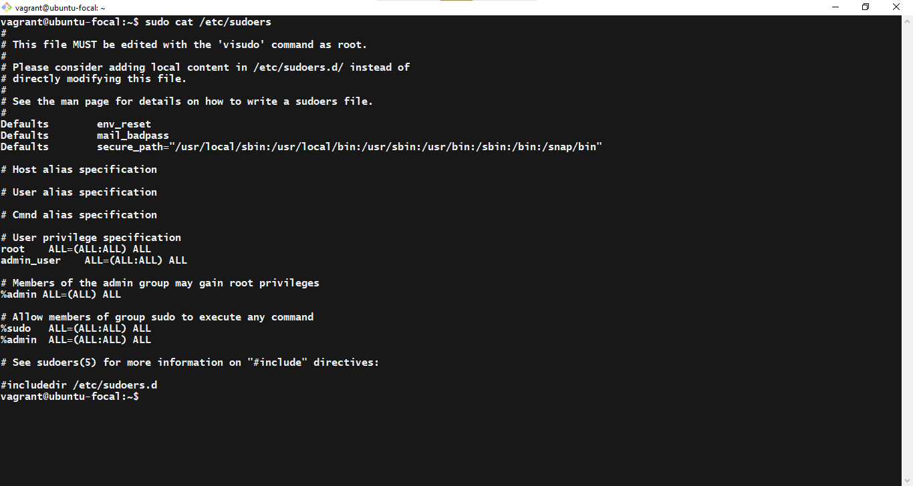

# Exercise:

Create 3 groups – admin, support & engineering and add the admin group to sudoers. 
Create a user in each of the groups. 
Generate SSH keys for the user in the admin group

## Instruction:

Submit the contents of /etc/passwd, /etc/group, /etc/sudoers.

## Solution
<ol>
   <li>

   ```sh
  sudo tail /etc/passwd
  ``` 

  
   </li>

   <li>
   
   ```sh
  sudo tail /etc/group
  ``` 

  
   </li>

   <li>
   
   ```sh
  sudo cat /etc/sudoers
  ``` 

  
   </li>


</ol>